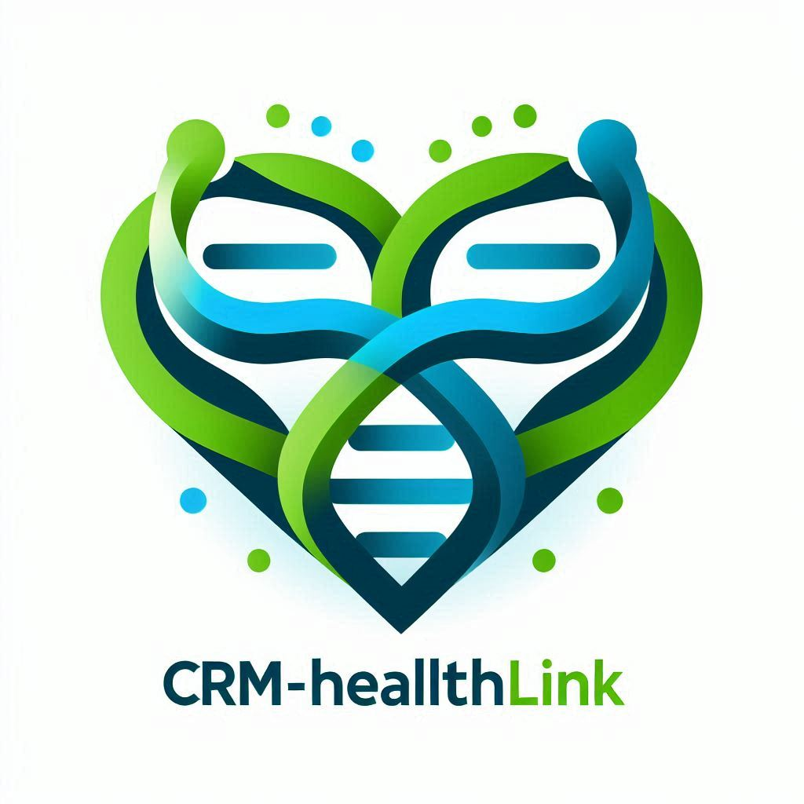

# CRM-HealthLink
>> Projeto desenvolvido para a disciplina de Desenvolvimento Web II - IFPE Campus Palmares


## 🔗 Acesse o Swagger pelo link
```sh
http://localhost:8080/swagger-ui/index.html
```

## 🗂️ Repositório Front-End
[Acesse o Link](https://github.com/LucasM1415/CRM-HealthLink-FrontEnd)


## 📋 Sobre o Projeto - Sistema de Gestão de Pacientes

O sistema de gestão hospitalar tem como objetivo resolver problemas de má gestão em hospitais, abrangendo desde o registro de pacientes e médicos até o agendamento de consultas e exames. Oferecendo uma plataforma integrada, o sistema visa melhorar a eficiência operacional e garantir um atendimento de qualidade aos pacientes. 

Esse sistema é projetado para centralizar e automatizar diversas tarefas administrativas, reduzindo a carga de trabalho manual e minimizando erros humanos. Com funcionalidades que incluem a gestão de prontuários eletrônicos, controle de estoque de medicamentos, e acompanhamento financeiro, a plataforma proporciona uma visão holística e em tempo real das operações hospitalares. Além disso, o sistema de gestão hospitalar facilita a comunicação entre diferentes departamentos, promovendo a colaboração e a troca rápida de informações. Isso resulta em uma melhor coordenação de cuidados, onde médicos, enfermeiros e outros profissionais de saúde podem acessar e atualizar dados dos pacientes de maneira segura e eficiente.

A implementação de um sistema desse tipo também contribui para a melhoria na tomada de decisões clínicas e administrativas, através de análises de dados e relatórios detalhados. Com essas ferramentas, gestores hospitalares podem identificar gargalos, prever necessidades futuras e planejar estratégias de longo prazo com maior precisão. Em termos de atendimento ao paciente, a plataforma permite um agendamento mais organizado e uma redução no tempo de espera, além de proporcionar um acompanhamento mais rigoroso do histórico médico dos pacientes. Isso não apenas melhora a satisfação dos pacientes, mas também eleva o padrão de cuidado oferecido.

Em resumo, o sistema de gestão hospitalar é uma solução abrangente e indispensável para a modernização e eficiência dos serviços de saúde, garantindo que os hospitais operem de maneira mais eficaz e com um foco constante na qualidade do atendimento ao paciente.




## 👥 Contribuidores

- [Jair Victor](https://github.com/JairAssisDev)
- [Lucas Patrick](https://github.com/lucasptrick)
- [Lucas Manoel](https://github.com/lucasM1415)
- [Matheus Kennedy](https://github.com/MasterKingRR)
